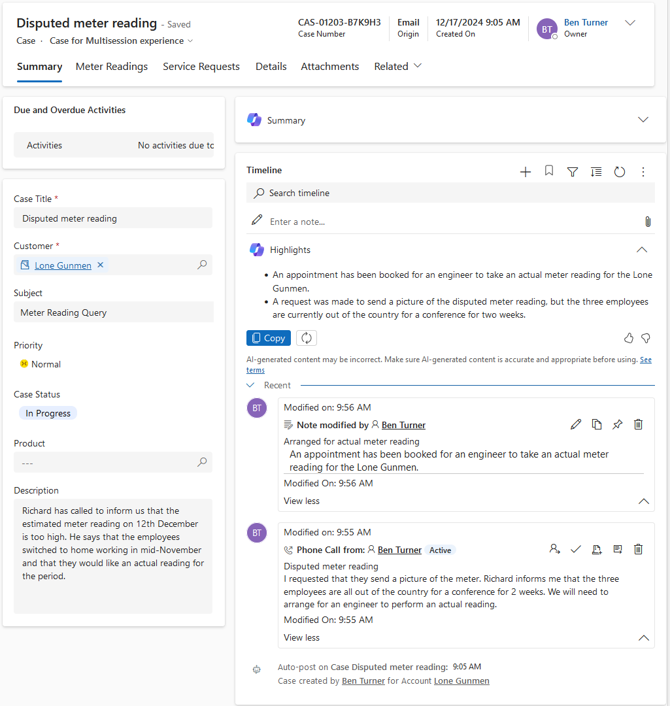
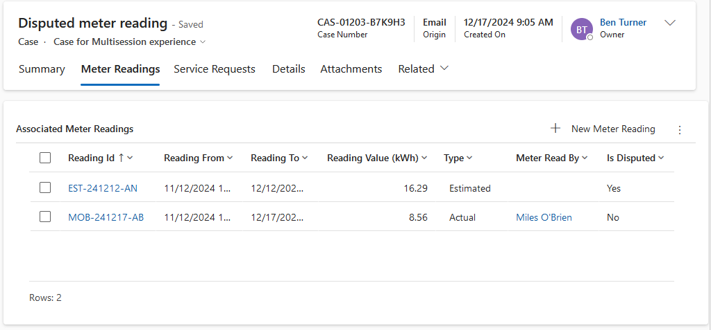
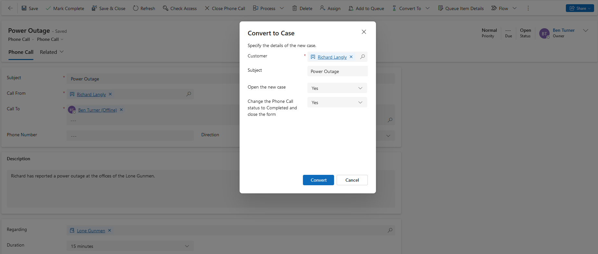
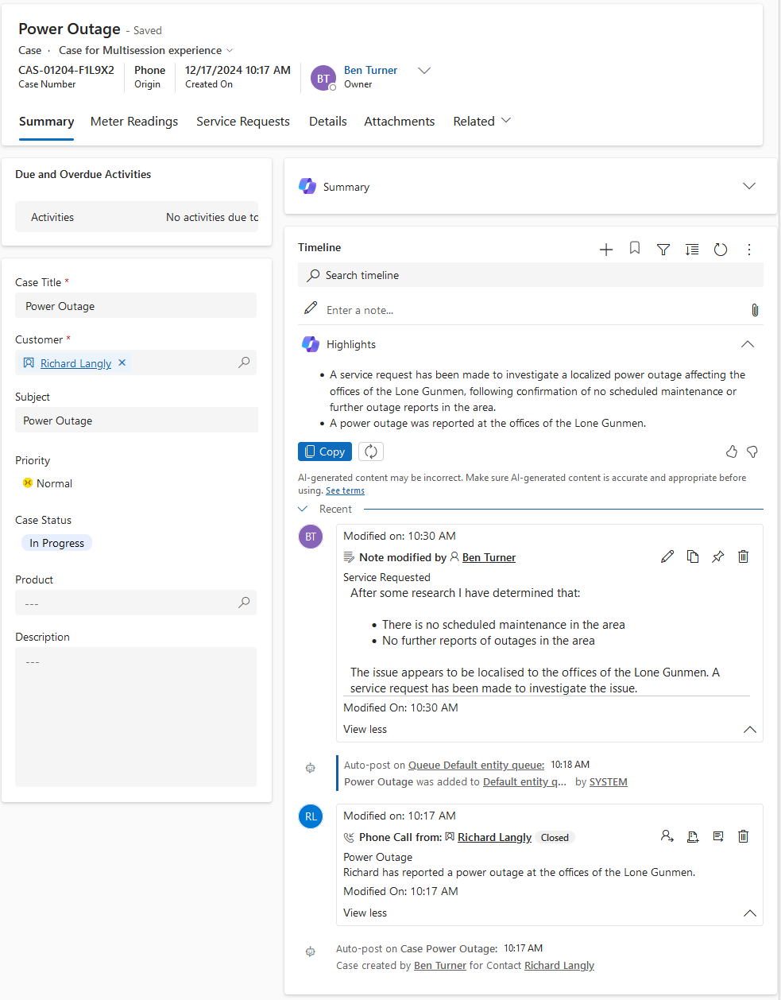
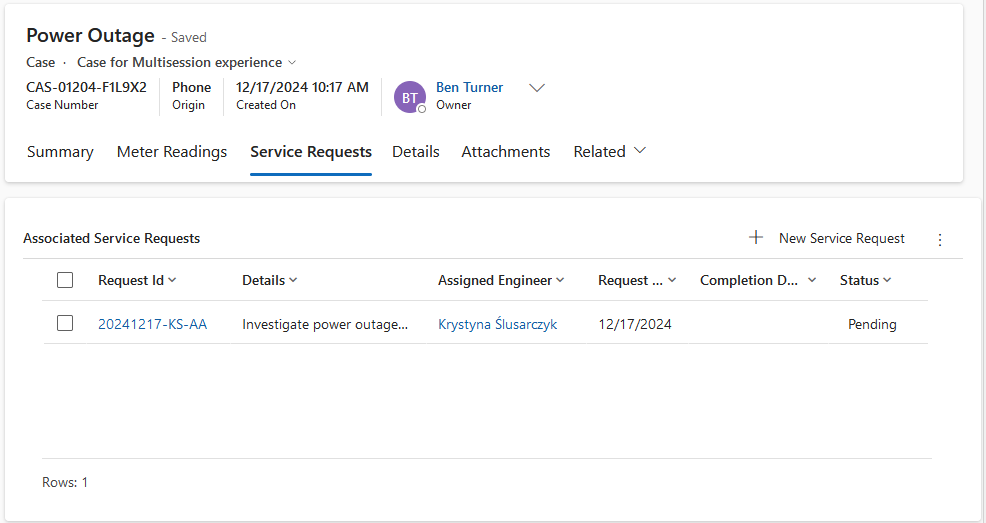

# Scenario 1

## Brief

You are a customer service manager at City Power & Light who has been tasked
with trying the new case functionality before rolling it out to your users.
In this task, you will create new customer cases and create phone calls
associated with the cases.

**Create Custom Table**

In this exercise, you will be creating two new custom tables. These tables will
link to cases. You will create two many-to-one relationships for the Case and
Custom tables. Add sub-grids for the many-to-many relationship between Case and
Custom tables to the case form.

**Create Case**

In this exercise, you will create an Account, a Contact, and a Case record. You
will also add a Phone Call activity to the case.

**Create Case from an Activity**

In this exercise, you will create a Phone Call activity and then convert the
activity to a Case.

## Actions

**Create Custom Table**

Two custom tables have been created with a many to one relationship with the
case table.

The first table created is meter readings. The thinking here was that a customer
may call to dispute an estimated meter reading, provide an accurate reading and
that a new, updated reading may then be created. This table has an optional
field referencing a case so that disputed and updated readings may be associated
with a case.

The second table is service requests. The thinking here is that a service
request may be added to a case to try and resolve an issue. If the issue is not
resolved then follow-up service requests may be added.

Both tables also have a many to one relationship with Bookable Resources. I have
created a Bookable Resource Characteristic Type of Engineering and a number of
skills under this type including:

- Meter Reader
- Field Service Technician

These tables and the sub-grids are evident in screenshots for the next sections.

**Create Case**

A case has been created disputing an estimated meter reading. An Account (Lone
Gunmen), and Contact (Richard Langly) have also been created.

A phone call activity has been attached. The result of the conversation is that
an actual meter reading should be arranged.

A note is then attached to indicate that an actual meter reading has been
arranged.

_Creation of a case with an attached phone call_

_Meter reading sub-grid for the above case_

**Create Case from an Activity**

For this exercise a phone call activity has been created for a power outage.
This has then been converted to a case.

After investigating if there is a broader issue in the area, a Service Request
has been initiated to investigate the issue.

_Conversion of phone activity to a case_

_Case created from phone activity_

_Service request sub-grid for the above case_
