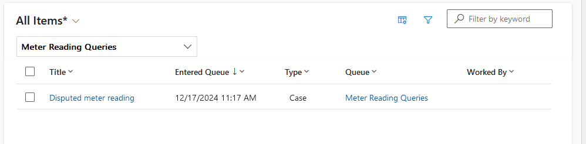
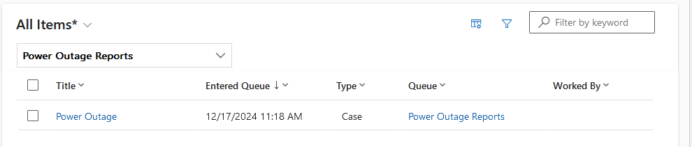

# Scenario 2

## Brief

You are a customer service manager at City Power & Light. You need to create
queues for the customer service representatives to use for processing cases.
In this task, you will create a create multiple queues and add cases to
queues.

**Create Queues**

In this exercise, you will Create Queues and Add cases to queues.

## Actions

For this exercise two basic queues have been created:

- Meter Reading Queries
- Power Outage Reports

The two cases created in the previous scenario have been manually routed to the
appropriate queues.

_Manual routing of a case to the Meter Reading Queries queue_

_Manual routing of a case to the Power Outage Reports queue_
