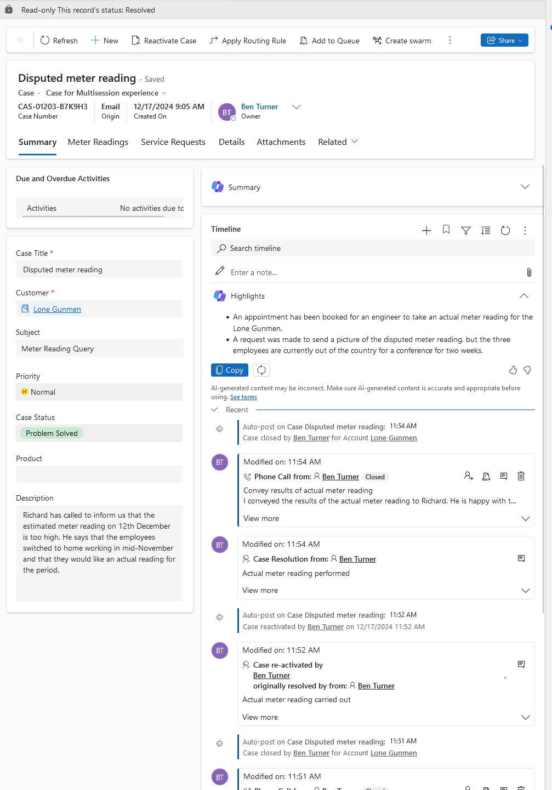

# Scenario 3

## Brief

You are a customer service manager at City Power & Light who has been tasked
with trying the new case resolution and reactivation functionality before
rolling it out to your users. In this task, you will:

- resolve a case
- reactive that case.

## Actions

For this scenario, the Disputed Meter Reading case has been resolved following
the performance of an actual meter reading.

The agent, realising that they forgot to add a phone call activity informing the
customer of the new meter reading, reactivates the case.

Once the activity has been added, the case is resolved again.

_Timeline showing resolution and reactivation of a case_
