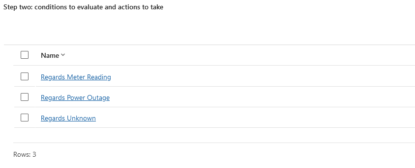

# Scenario 4

## Brief

You are a customer service manager at City Power & Light who has been tasked
with trying the new case routing functionality before rolling it out to your
users.

In this task, you will create record creation rules, and case routing
rules and test how they work.

### Record Creation Rules

Enable a case to be created from an email

### Queue Basic Routing

Configure basic routing rule set and route cases.
rolling it out to your users.

## Actions

### Actions: Record Creation Rules

For this scenario, an email to case rule set has been created. Three actions
have been set-up to add information for agents and to help when routing the
newly created cases.

The first two rule items are:

- Regards Meter Reading
- Regards Power Outage

The conditions in these rules look for keywords in the email which suggest it
concerns a meter reading query or power outage report respectively. If the
conditions are met, a flow will run which populates the subject field with the
appropriate value.

There is a final rule item, Regards Unknown, which is used to catch items that
do not meet the conditions in the previous rule items.

_List of rule items in the record creation rule_

_Conditions set for the Regards Meter Reading rule item_

_Flow for the Regards Meter Reading rule item_

#### Flow Customisations

The above flow modifies the templated flow by adding a Get Row by Id step, this
accesses the appropriate subject record by its GUID. This is then used to
populate the subject field.

In addition to the subject field:

- The email body has been set as the description for cases in all flows
- The type is set to problem in the first two flows

### Actions: Queue Basic Routing

For queue routing I have set-up three rules corresponding to those in the record
creation. These simply check the subject field of the email and route to the
appopriate queue:

_Case based routing rule items_

## Demonstration

The functionality for this scenario is demonstrated alongside the functionality
of scenario 5. Please see the scenario 5 file.
