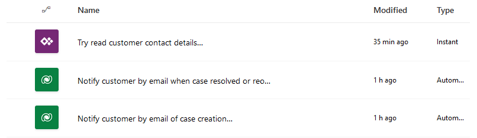
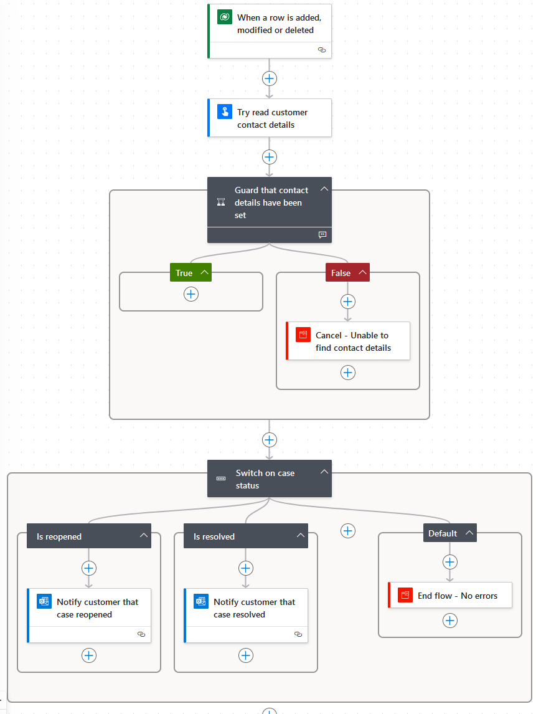
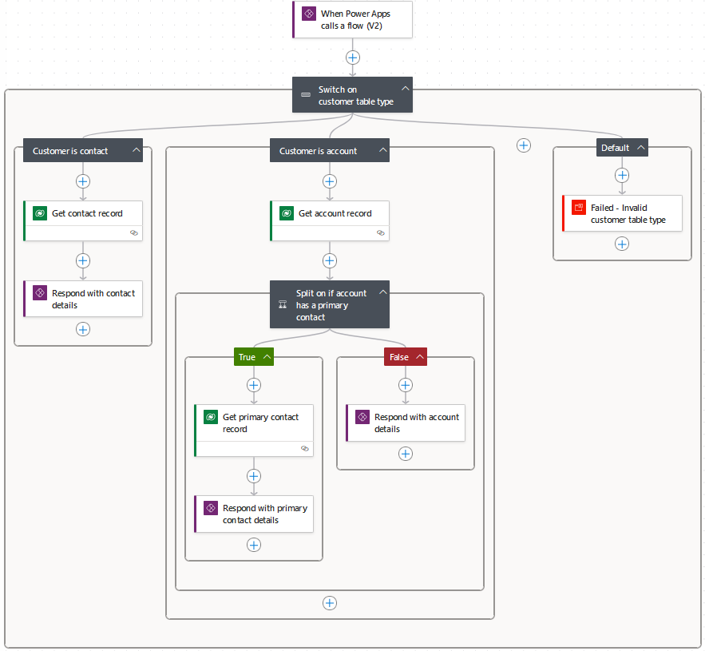
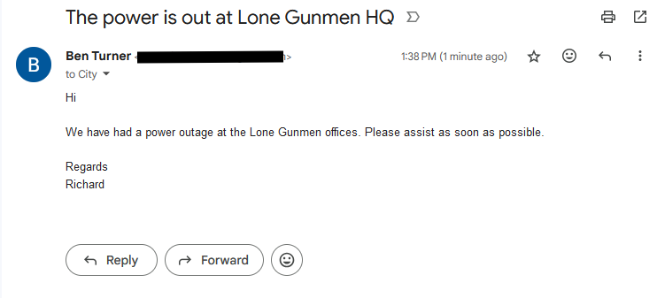
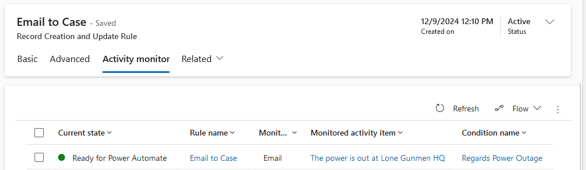
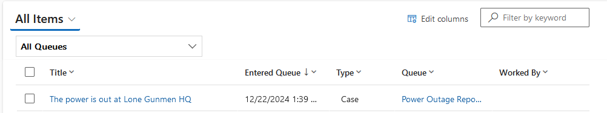
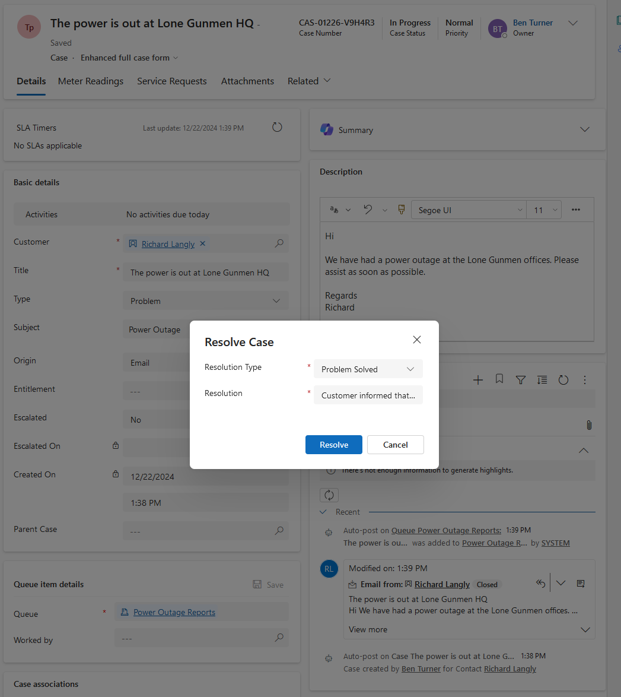
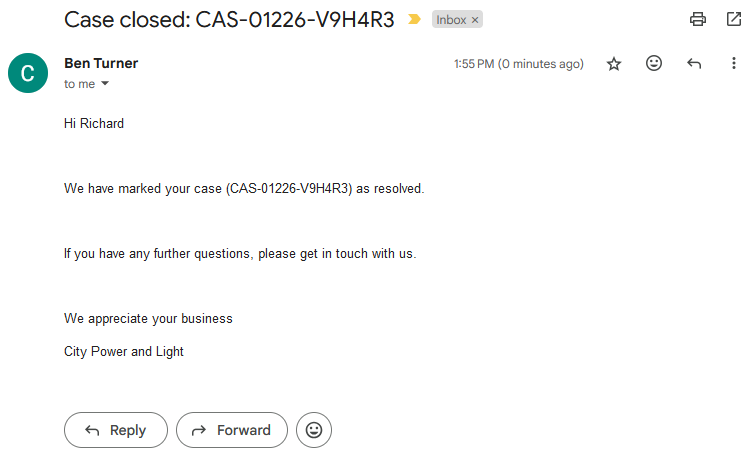
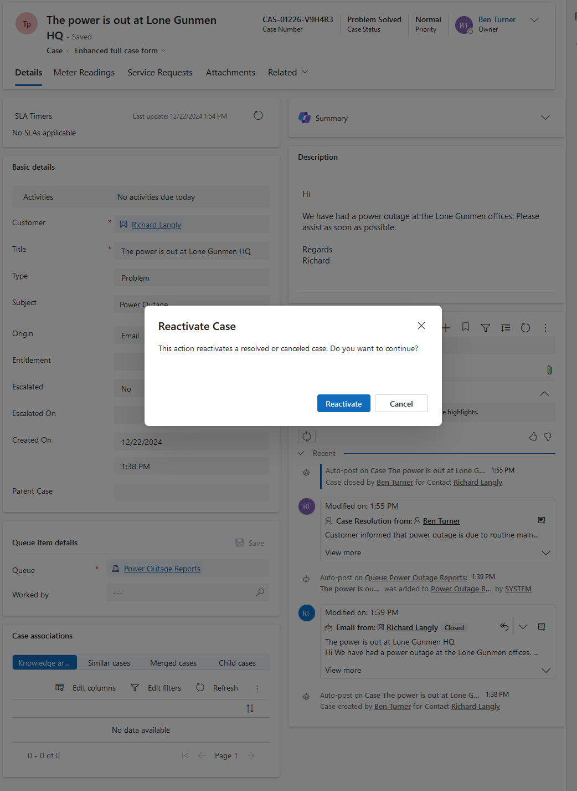
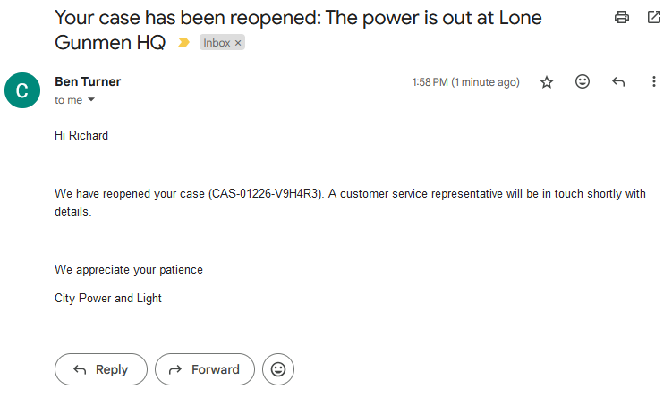

# Scenario 5

## Brief

You are a customer service manager at City Power & Light who has been tasked
with trying the email functionality before rolling it out to your users.

In this exercise, you will create Power Automate cloud flows to send an email
notification to the related account when the case is:

- Created
- Resolved
- Reopened

## Actions

### Actions: Flow Design

For this scenario, three flows have been created.

_Custom flows for email notifications_

A single flow may have worked, but I could not see a way to do this without
modifying the incident record. I was reluctant to modify a record with the sole
aim of controlling the notification flow, so I decided to use two parent flows
and a child flow containing common logic.

### Actions: Parent Flows

The parent flows are triggered when a row is added, modified or deleted. The
triggers have been customised as follows:

- Create: Only triggered when a case is added
- Reopen/Resolve: Only triggered when the statecode field of a case is modified

_Overview of Reopen/Resolve flow_

Both parent flows use the "Try read customer contact detatils" child flow to
extract an email and name from the customer field of the case. There are a number
of scenarios where the child flow will not these set values. I wanted to let the
parent flows handle this situation, so both parent flows have a guard clause to
check that these values have been set.

With the create flow, an email is sent after the guard clause. With the
reopen/resolve flow there is a switch statement to send an appropriate email
depending on whether the case was reopened or resolved.

### Actions: Child Flow

This child flow is responsible for looking at the customer record and returning
a name and an email. An early iteration of this flow used variables, this was
able to account for more situations but it was not very readable.

I have opted for the version below to try and keep the flow simple and readable:

_Overview of the child flow_

As mentioned, there are cases where the flow will return empty values for the
contact details. This is handled by the parent flows.

I have tested the following scenarios manually and can give details if needed:

- Customer is a contact with an email address
- Customer is a contact without an email address
- Customer is an account with a primary contact with an email address
- Customer is an account with a primary contact without an email address
- Customer is an account with no primary contact and an email address
- Customer is an account with no primary contact and no email address

The second to last scenario listed is not handled well by the simplified version
I have opted for. The previous version would use the email from the account and
the name from the primary contact. I have decided, rightly or wrongly, that this
is an acceptable compromise to keep things readable and avoid over-engineering
the flow.

## Demonstration

_An email is sent requesting support_

_The email is converted to a case using the Regards Power Outage rule_

_The case has been created and routed to the appropriate queue_

_An email is received by the customer indicating that the case has been created_

_The case is resolved_

_The customer is notified about the resolution_

_The case is reopened_

_The customer is notified that the case has been reopened_
